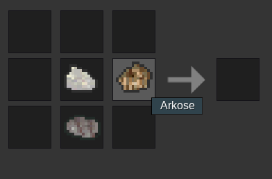
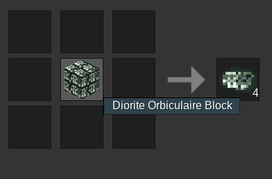

# rockcollection-luanti-mod-mtg

Welcome to the world of rocks!
There are two categories of rocks.
Igneous:
- Obsidian (default, don't bother.)
- Andesite (Rock)
- Agpaitic Rock
- Alkali Feldspar Granite
- Anorthosite
- Basalt (Rock)
- Basaltic Andesite
- Diorite Orbiculaire (aka Napoleonite)
- Diorite (Rock)
- Adakite
Every igneous rock can be found at the biome "Land O' Igneous" or "rockcollection:landoigneous"

Sedimentary:
- Coal (default, don't bother.)
- Argillite
- Arkose
- Banded Iron Formation (or BIF for short)
- Breccia
- Calcarenite
- Chalk
- Chert
- Claystone
- Conglomerate
- Coquina
Most sedimentary rocks can be found at the biome "Land O' Sedimentary" or "rockcollection:landosedimentary". Chalk is primarily found in the biome "Land O' Bones" or "rockcollection:landobones"

Land O' Sedimentary:

Land O' Bones:

Crafting:
ALL RECIPES ARE SHAPELESS 

uhhhh 

If you place a rock block in the crafting grid you get 4 of the item counterpart 
 
(If you want to make a rock block put 4 of the same rock in the crafting grid.)
